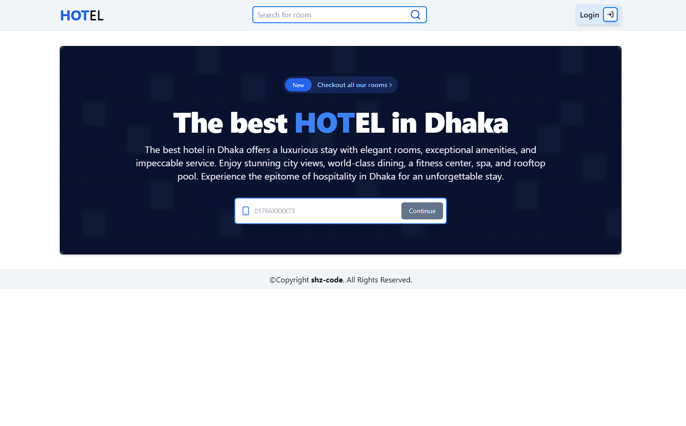

# HOTel

HOTel is a full-stack MERN application designed to facilitate hotel room bookings. It features a minimalistic and responsive design that works seamlessly across both desktop and mobile devices. The application allows users to sign up, log in, filter rooms based on facilities, and book rooms. The system ensures secure user authentication with hashed passwords using bcrypt and manages state efficiently with Redux.

Short Introduction Video:

[](https://youtu.be/Go9t8Llwy8I)

# ScreenShots




# Features

- **User Authentication**: Users can sign up and log in. Passwords are securely hashed using bcrypt.
- **Room Booking**: Users can filter rooms based on facilities and book them.
- **Booking Capacity Management**: The application tracks the booking capacity of each - room. If the room's booking capacity is reached, a message is displayed to the user.
- **Responsive Design**: The frontend is designed to be simple, minimal, and responsive, providing a seamless experience on both desktop and mobile devices.

# Technologies Used

- **Frontend**: React
- **State Management**: Redux
- **Backend**: Node.js
- **Database**: MongoDB

# Installation

### Prerequisites

- Node.js
- MongoDB
- npm or yarn

# Steps

- Clone the repository:

```sh
https://github.com/shz-code/hotel-booking.git
cd hotel-booking
```

- Install backend dependencies:

```sh
cd backend
npm install
```

- Install frontend dependencies:

```sh
cd ../client
npm install
```

#### Set up environment variables:

Create a `.env` file in the backend directory and add the following variables:

```env
PORT=4003
LOCAL_DB_URL=your_mongodb_url
NODE_ENV=development
```

- Create a `.env` file in the frontend directory and add the following variables:

```env
VITE_API_URL=http://localhost:4003/api
```

- Run the backend server:

```sh
cd backend
npm start
```

- Run the frontend server:

```sh
cd ../client
npm run dev
```

# Usage

- **Sign Up**: Users can create a new account by providing an phone number and password.
- **Log** In: Users can log in using their pphone number and password.
- **Filter Rooms**: Users can filter rooms based on available facilities.
- **Book Rooms**: Users can book rooms if the booking capacity has not been reached. If the capacity is reached, a message will be displayed.

# Project Structure

- backend/: Contains the Node.js server code and API routes.
- models/: Mongoose models for MongoDB.
- routes/: API routes for authentication, room filtering, and booking.
- client/: Contains the React application code.
- src/: Main source folder.
- components/: React components.
- features/: Redux actions, reducers, and store configuration.

# Contributing

Contributions are welcome! Please fork the repository and submit a pull request for any features, bug fixes, or enhancements.

# License

This project is licensed under the MIT License. See the LICENSE file for details.

# Contact

For any inquiries or support, please contact your email/ Linkedin.
